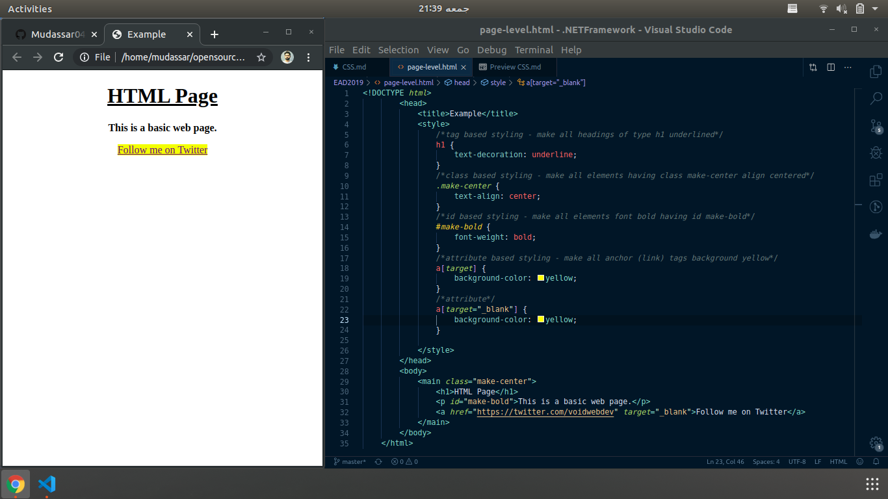

# Intro to CSS - Cacading style sheet

CSS (Cascading Style Sheets) is used to style and lay out web pages — for example, to alter the font, color, size, and spacing of your content, split it into multiple columns, or add animations and other decorative features

There are three different ways to apply CSS to an HTML document that you'll commonly come across

- Inline using `style` attribute
- At Page level using `<style>` tag
- In separate `.css` file

### Inline css - Style attribute

```html

    <div style="text-align:center;">
        <p style="color: red; font-size:1.5rem;">Hello, I love programming</p>
    </div>

```

### Page level using `<style>` tag

```html
    <!DOCTYPE html>
        <head>
            <title>Example</title>
            <style>
                /*tag based styling - make all headings of type h1 underlined*/
                h1 {
                    text-decoration: underline;
                }
                /*class based styling - make all elements having class make-center align centered*/
                .make-center {
                    text-align: center;
                }
                /*id based styling - make all elements font bold having id make-bold*/
                #make-bold {
                    font-weight: bold;
                }
                /*attribute based styling - make all anchor (link) tags background yellow*/
                a[target] {
                    background-color: yellow;
                }
                /*attribute*/
                a[target="_blank"] {
                    background-color: yellow;
                }
                /* mixture of above - any element that having child or children anchor (`<a></a>`), make their text color blue*/
                .make-blue a {
                    color: blue;
                }

            </style>
        </head>
        <body>
            <main class="make-center">

                <h1>HTML Page</h1>
                <p id="make-bold">This is a basic web page.</p>
                <a href="https://twitter.com/voidwebdev" target="_blank">Follow me on Twitter - Mudassar</a>

                <div class="make-blue">
                    <a href="https://example.com"> Hello, I'm blue</a>
                </div>

            </main>
        </body>
    </html>
```

OUTPUT OF THE ABOVE SNIPPET



### Separate CSS style `.css` file

Check the following snippet, how to add separate or external `.css` file to includes styles

```html

    <!DOCTYPE html>
        <head>
            <!-- adding external or separate css file -->
            <link rel="stylesheet" href="./extern-style.css">
            <title>Example World</title>
        </head>
        <body>
            <main class="make-center">
                <h1>HTML Page</h1>
                <p id="make-bold">This is a basic web page.</p>
                <a href="https://twitter.com/voidwebdev" target="_blank">Follow me on Twitter - Mudassar</a>
            </main>
        </body>
    </html>

```

### CSS BOX Model

The “CSS box model” is a set of rules that determine the dimensions of every element in a web page. It gives each box (both inline and block) four properties:

- **Content Box** – The text, image, or other media content in the element.
- **Padding Box** – The space between the box’s content and its border.
- **Border Box** – The line between the box’s padding and margin.
- **Margin Box** – The space between the box and surrounding boxes.

For more details on `Content`, `Padding`, `Border` and `Margin`,  visit [CSS BOX MODEL](https://internetingishard.com/html-and-css/css-box-model/)

Visually,


**Example for Standard CSS Box**

```css

.box {
  width: 350px;
  height: 150px;
  margin: 25px;  /* top: 25px right: 25px bottom: 25px left: 25px*/
  padding: 25px; /* top: 25px right: 25px bottom: 25px left: 25px*/
  border: 5px solid black;
}

```

### CSS Positioning - `position` property

The `position` property specifies the type of positioning method used for an element (static, relative, fixed, absolute or sticky)
Following are the position properties

- **static** - HTML elements are `positioned: static;` by default.
- **relative** - An element with `position: relative;` is positioned relative to its normal position.
- **fixed** - An element with position: fixed; is positioned relative to the viewport, which means it always stays in the same place even if the page is scrolled 
- **absolute** - An element with position: absolute; is positioned relative to the nearest positioned ancestor (instead of positioned relative to the viewport, like fixed)
- **sticky** - An element with position: sticky; is positioned based on the user's scroll position. A sticky element toggles between relative and fixed, depending on the scroll position.