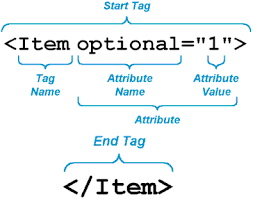

# Intro to HTML

HTML is the standard markup language (**`NOT PROGRAMMING LANGUAGE`**) for Web pages

- Tag
- Attribute
- Block element vs. Non-Block Element
- Elements who have any impact in renderings vs. elements who doesn’t have

### Tags in HTML

There are tow types of tags:

- Paired Tags
- Unpaired Tags

**Paired Tags**

A paired tag consist of two tags, first one is called an `opening tag` and the second one is called a `closing tag`. These tags contains the text in between at which the effect of that tag will be applied e.g. `<b>ABC</b>`
Here <b> is the opening tag, </b> is the closing tag and ABC the text in between which will result as ABC on the browser screen.

More examples

```HTML
    <i> </i>
    <div> </div>
    <ul> </ul>
    <h1> </h1>
```

**Unpaired Tags**

An Unpaired tag is a single tag which does not need a companion tags. These tags can be written like < > or < /> both works

There are `block` and inline `elements` in the `DOM`. If you’re concerned about the tags in the source code, the two types would be:

- tags that may take children, example: `<div> </div>`, `<p> </p>` etc.

- tags that may not take children (also known as self-closing tags), example: ``, `<input />` ect.

### HTML Attributes

- All HTML elements can have attributes
- Attributes provide `additional information` about an element
- Attributes are always specified in the `start tag`
- Attributes usually come in name/value pairs like: `name="value"`

Anatomy of paragraph tag `<p>`


Anatomy of html tags



## Block element vs. Nonblocking

HTML is made up of various elements that act as the building blocks of web pages. For the purpose of styling, elements are divided into two categories: block-level elements and inline elements.

In summary, a `<span>` element is used as an `inline`(nonblocking) element and a `<div>` element as a `block` level element

### Inline - Nonblocking elements**

An inline element `does not` cause a `line break` (start on a new line) and does not take up the `full width` of a page, only the space bounded by its opening and closing tag. It is usually used within other HTML elements

Other examples of inline elements are:

- anchor `<a>` tag
- emphasis `<em>` tag
- image `` tag

### Blocking elements

A block-level element always `starts on a new line` and takes up the full width of a page, from left to right. A block-level element can take up `one line` or `multiple lines` and has a `line break` before and after the element

Other examples of the block-level tag are:

- Heading tags `<h1>` to `<h6>`How browser rendering works — behind the scenes
- List (Ordered, Unordered, Description and List Item) tags `<ol>` , `<ul>` ,`<dl>` , `<li>`
- Pre-formatted text tag `<pre>`
- Blockquote tag `<blockquote>`

### Graphic Demo


### Elements who have any impact in renderings vs. elements who doesn’t have

For better understanding just go through following link

[How browser rendering works — behind the scenes](https://blog.logrocket.com/how-browser-rendering-works-behind-the-scenes-6782b0e8fb10/)